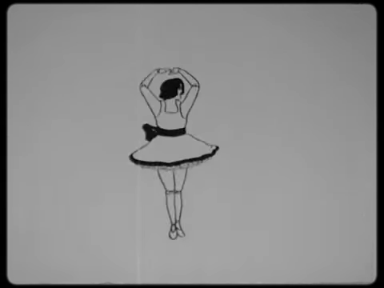
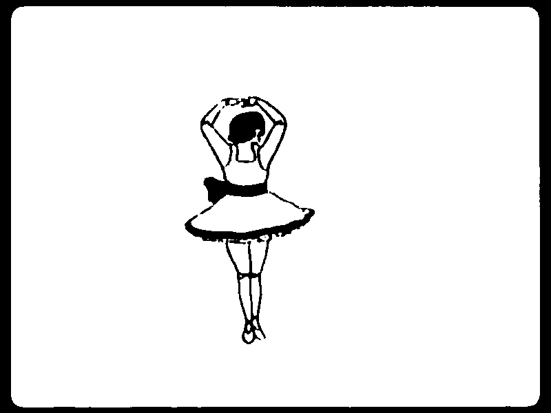
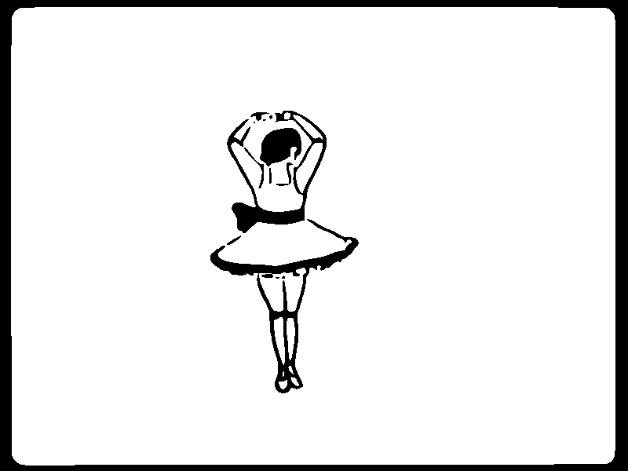

# Doll Dancing

This project creates animated GIFs of a doll dancing from a segment of the film *Mechanical Doll.* The output GIF files consist of bilevel images so that they can be shown in quick succession on an e-paper display using the animation (A2) *waveform* mode, which works only with pure black and white pixels.

## Background

[*Mechanical Doll*](https://commons.wikimedia.org/wiki/File:Mechanical_Doll_(1922).webm "File:Mechanical Doll (1922).webm"), also known by the title *The Dresden Doll,* is a short American animated film produced by [Max Fleischer](https://en.wikipedia.org/wiki/Max_Fleischer) and directed by [Dave Fleischer](https://en.wikipedia.org/wiki/Dave_Fleischer). It was released in 1922 by Inkwell Studios as part of the series *Out of the Inkwell.* Max Fleischer drew the dancing sequence using his recently invented [rotoscoping](https://en.wikipedia.org/wiki/Rotoscoping) technique on a film of [his daughter Ruth](https://seymourkneitel.blogspot.com/2012/12/meet-my-mom.html "Meet My Mom! (by Ginny Mahoney)"), who was 16 years old at the time.

## Licenses

The *Mechanical Doll* video file is in the public domain in the United States.

The content of this project itself is licensed under the [GNU General Public License v3.0](https://choosealicense.com/licenses/gpl-3.0/). The animated GIF files produced by this project are dual-licensed under the GNU General Public License v3.0 and the [Creative Commons Attribution Share Alike 4.0 International](https://choosealicense.com/licenses/cc-by-sa-4.0/) license.

## Building

The [Makefile](Makefile) requires the following programs on your PATH environment variable. Note that *ffmpeg* is launched from */snap/bin/ffmpeg* to use the [latest version](https://snapcraft.io/ffmpeg "FFmpeg by Snapcrafters") in the Snap Store.

* **ffmpeg** – a video converter
* **convert** – converts between image formats and edits images
* **mkbitmap** – transforms images into bitmaps with scaling and filtering
* **potrace** – transforms bitmaps into vector graphics
* **inkscape** – an SVG editing program

By default, the `make` command builds only *doll-dancing.gif*. To build *doll-traced.gif*, you must specify it as a target. If you have multiple processor cores on your computer, the build process can go much faster if you pass the *jobs* option to specify the number of cores. For example:

```ShellScript
$ make -j 4 doll-traced.gif
```

## Images

This project creates animated GIF images from the sequence of 360 frames in which the mechanical doll dances, as described below.

* **doll-dancing.gif** – the 360-frame sequence created by appending the 180 odd frames with the 180 even frames in reverse, creating a loop with matching endpoints. Uses thresholding with no dithering to create the bilevel images.

* **doll-traced.gif** – the same sequence as the previous animation except that the frames are created by tracing each one into a vector graphics format before rendering them into their final size.

The source video is 30 frames per second, but the original animation consists of 24 frames per second, so every 5th frame is a duplicate and removed. The final sequence of odd and even frames runs at 12 frames per second to match the speed of the original animation.

A single frame in the original video is converted as shown in the samples below.

| Frame Conversion Samples |
|:------------------------:|
|  |
| A frame in the original video (480 × 360 px) |
|  |
| The same frame in *doll-dancing.gif* (800 × 600 px) |
|  |
| The same frame in *doll-traced.gif* (800 × 600 px) |
